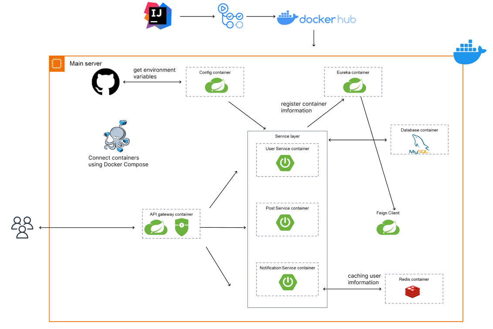

# GDG_MSA
GDGoC 4기 MSA 스터디의 docker compose와 spring cloud를 이용한 MSA 실습 레포지토리입니다.

---
## 학습 방향
### 1주 ~ 5주
AWS(EC2, RDS)와 docker, docker compose의 이론 및 실습으로 기본적인 배포 인프라를 학습

### 6주 ~ 10주
Spring Cloud의 기본 요소(eureka, config, API gateway, Feign client,  Resilience4j)를 공부하며 
실습 아키텍처 구현

## 실습 Architecture

## 추후 방향
컨테이너를 다루는 docker compose와 쿠버네티스의 차이점을 알아보고 아키텍처를 쿠버네티스로 바꾸는 방향으로 디벨롭할 예정입니다.